

# Pacmann - Relational Database & SQL Project!
**This is a part or journey of the Pacmann Bootcamp**

  

<h1 align="center">Hi Mate👋, I am Rahmad Gunawan 
from SDE Batch 01 Pacmann</h1>
<h3 align="center">Relational Database & SQL Project</h3>

By [Rahmad Gunawan](https://www.linkedin.com/in/ragunnn/)
## Dashboard

  <a href="https://youtu.be/Uycz73DydLM">
    
     
    <b>Youtube Presentation</b>
  </a>

<h2><b>Relational Database & SQL Project!</b></h2>

Creating an ERD for a used car marketplace database to inform the data model and drawing insights from the data to understand the marketplace better

## Project Overview: Used Car Marketplace Database

This project aims to create an entity-relationship diagram (ERD) for a used car marketplace database. The ERD will serve as the foundation for the database schema and will be used to inform the creation of the data model. In addition, insights will be drawn from the data to better understand the used car marketplace and inform future business decisions.

The database will include tables for cars, sellers, buyers, transactions, and bidding history. The cars table will contain information such as the make, model, year, price, and location of the car. The sellers table will include information such as the seller's name, contact information, and the cars they have for sale. The buyers table will contain information such as the buyer's name and contact information. The transactions table will include information such as the sale price, date, and payment method. Finally, the bidding history table will contain information about the bidding history of each car.

The insights drawn from the data will include patterns in car sales, popular models and makes, and average prices. This information can be used to better understand the used car marketplace and inform future business decisions such as pricing strategies, marketing campaigns, and inventory management.

Overall, this project aims to create a robust database schema and use the data to draw insights that can inform business decisions for a used car marketplace.

## Feature Requirements
---
    - User Profile: The application should allow users to offer more than one used car for sale. Before selling, 
    users must complete their personal information, including name, contact information, and location.
    - Product Listings: Users can post their car for sale on the platform, and the listing should include product details 
    such as make, model, body type, transmission type, and year of manufacture. Optional information like color and mileage can also be added.
    - Search Functionality: Users can search for available cars based on the seller's location, make, and body type
    - Bidding Feature: If the seller allows the bidding feature, potential buyers can make a bid on the product.
    - Ad Display: The platform should display ads with product information, titles, and seller contacts.
    - Entity-Relationship Diagram (ERD): The project should include the creation of an ERD for the database schema.
    - Insights: The project should involve drawing insights from the data to understand the used car marketplace better.
    - Scope: The project should not include developing a payment or transaction system since the transactions for 
    purchasing a car will be conducted outside of the platform.

 ## Here's how to use the program:
   
    - Download the SQL files and Table_Design script to your local directory.
    - Open your preferred SQL client and navigate to the local directory.
    - Run the Table_Design script to create the table schema by executing the DDL commands.
    - Use the faker library to generate data that matches the table schema by running the Jupyter notebook file that contains the data input code.
    - Once you have generated the necessary data, run the Transactional Query and Analytical Query scripts to extract insights from the data.
    - Follow the prompts in the scripts to input the required details for the queries.
    - Enjoy analyzing the data and gaining insights from the project!

 ## ERD Table Design

  

  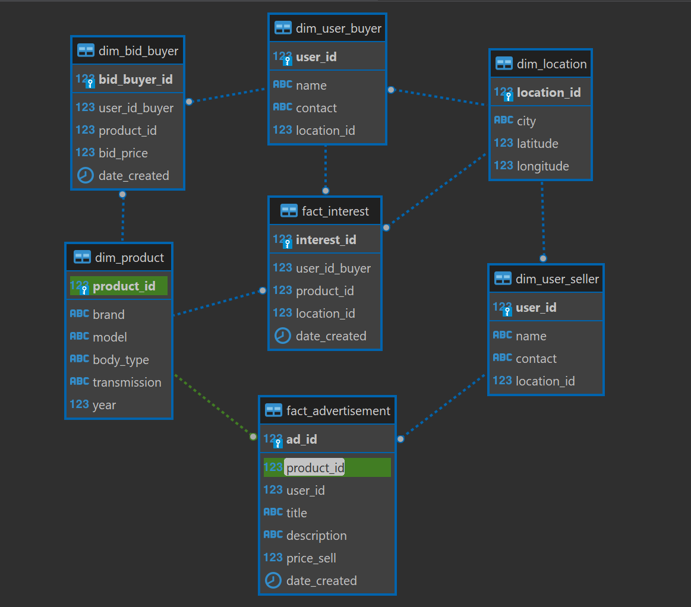
  
 

 
 ## Designing The Database:
    
    - Identify the entities: We have identified seven entities: Location, Product, User_seller, User_buyer, Bid_buyer, Advertisement, and Interest.
    - Create tables: We will create tables for each entity, following the data structure provided for each entity.
    - Define primary keys: For each table, we will define a primary key. The primary key uniquely identifies each row in the table.
    - Define foreign keys: We will define foreign keys in tables where one table needs to reference another table. For example,
     the User_seller and User_buyer tables have a foreign key referencing the Location table.
    - Define table relationships: We will define the relationships between tables based on the data structure. For example, the Product table 
    has a one-to-many relationship with the Advertisement and Bid_buyer tables, and the User_buyer table has a one-to-many relationship with 
    the Bid_buyer and Interest tables.
    - Implement table constraints: We will implement constraints to ensure data integrity, such as requiring non-null values for certain columns.
    - Populate the database: We can now populate the database with data.

Following these steps, we can create a functional relational database based on the given data.

- The system contains a list of 7 objects that require representation in the database. These objects include Location, 
- Product, User_seller, User_buyer, Bid_buyer, Advertisement, and Interest.

Based on the identified objects, I created table structures for each object. For each table, I determined the required columns and their respective data types. I also specified primary keys and foreign keys as necessary. The table structures that I created are as follows:

    - Location table: includes columns for location_id (primary key), city, latitude, and longitude.
    - Product table: includes columns for product_id (primary key), brand, model, body_type, transmission, and year.
    - User_seller table: includes columns for user_id (primary key), name, contact, and location_id.
    - User_buyer table: includes columns for user_id (primary key), name, contact, and location_id.
    - Bid_buyer table: includes columns for bid_buyer_id (primary key), user_id_buyer, product_id, bid_price, and date_created.
    - Advertisement table: includes columns for ad_id (primary key), product_id, user_id, title, description, price_sell, and date_created.
    - Interest table: includes columns for interest_id (primary key), user_id_buyer, product_id, location_id, and date_created.

## Implementing The Design.
    
      The implementation of the database design involves creating seven tables, each corresponding to one of the objects. 
      - The first table is called dim_location, which contains information about the location of the products, sellers, and buyers. 
      This table has columns for location_id, city, latitude, and longitude.
      - The second table is dim_user_seller, which contains information about the sellers. This table has columns for user_id, 
      name, contact, and location_id, where location_id is a foreign key that references the location table.
      - The third table is dim_product, which contains information about the products. This table has columns for product_id, 
      brand, model, body_type, transmission, and year.

 

  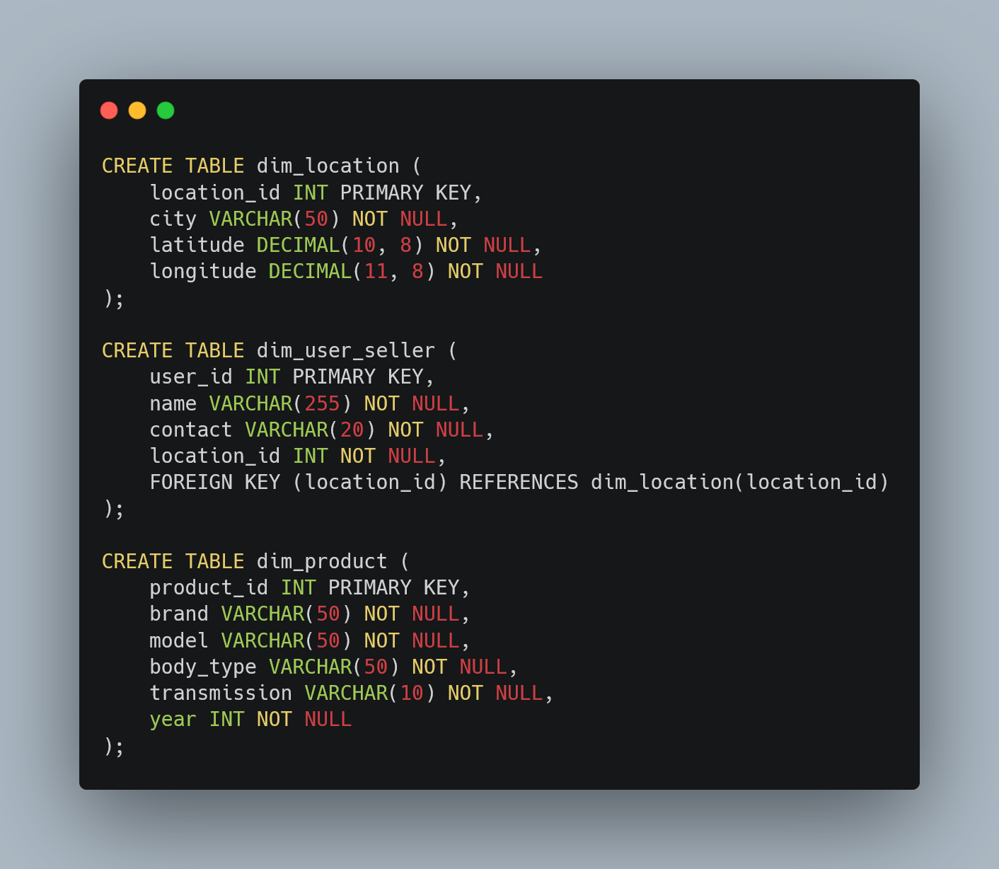
  
 

    - The fourth table is dim_user_buyer, which contains information about the buyers. This table has columns 
    for user_id, name, contact, and location_id, where location_id is a foreign key that references the location table.
    - The fifth table is dim_bid_buyer, which contains information about the bids made by buyers. 
    This table has columns for bid_buyer_id, user_id_buyer (a foreign key that references the buyer table), 
    product_id (a foreign key that references the product table), bid_price, and date_created.
    - The sixth table is fact_advertisement, which contains information about the advertisements created by 
    the sellers. This table has columns for ad_id, product_id (a foreign key that references the product table), 
    user_id  (a foreign key that references the seller table), title, description, price_sell, and date_created.
    - The seventh table is fact_interest, which contains information about the interests of the buyers 
    in the products. This table has columns for interest_id, user_id_buyer (a foreign key that references 
    the buyer table), product_id  (a foreign key that references the product table), location_id 
    (a foreign key that references the location table), and date_created.

 

  SQL Script for Creating Customer Table in ERD.
 

 

  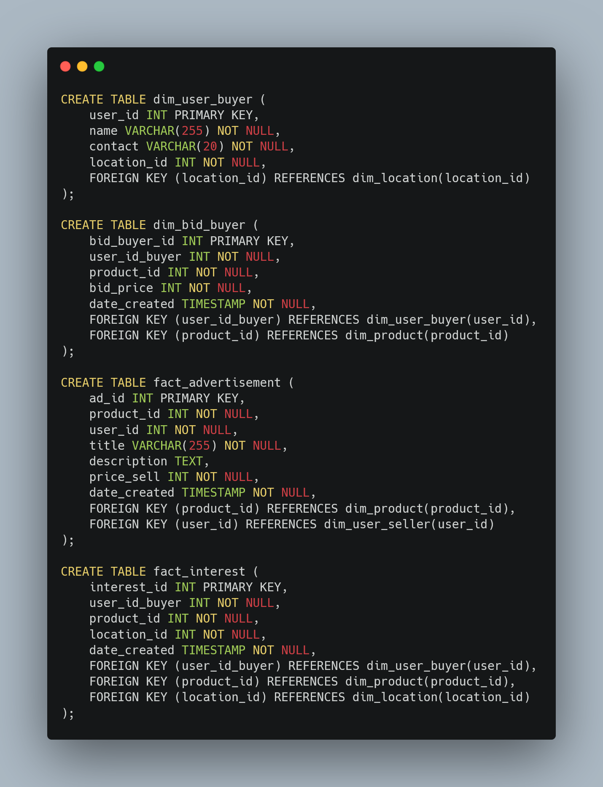
 

    Overall, this implementation provides a well-structured database that is easy to query and analyze. 
    It also ensures that the data is properly organized and related to each other through the use of foreign keys.

## Populating the database

    The first step in populating the database is to insert the provided data for the dim_location and dim_product 
    tables, which are in CSV format. We can use the script below to insert the data. Once the data is available, 
    we will generate additional data using Faker.

 

  Insert Data dim_location and dim_product
 

 

  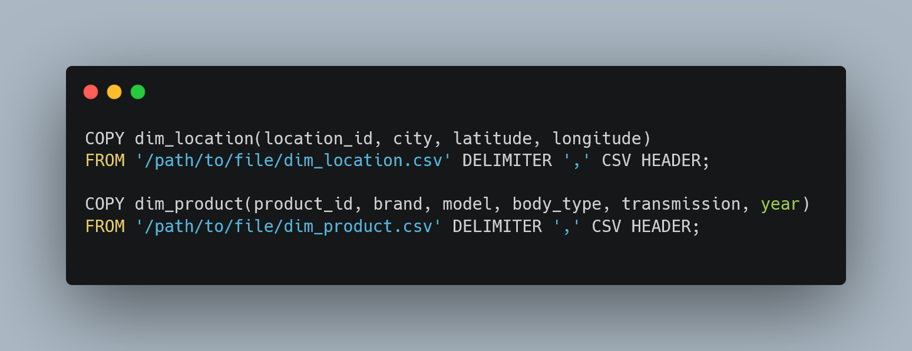
 

## Generate Data using Faker
     The next step is to generate data using faker. The entire data that needs to be generated is 
     already provided in a Jupyter notebook file, which just needs to be executed. The notebook file 
     is located in the ipynb folder. The following steps will be taken:

 

  Importing Modules and Establishing Connection to PostgreSQL using Psycopg2
 

 

  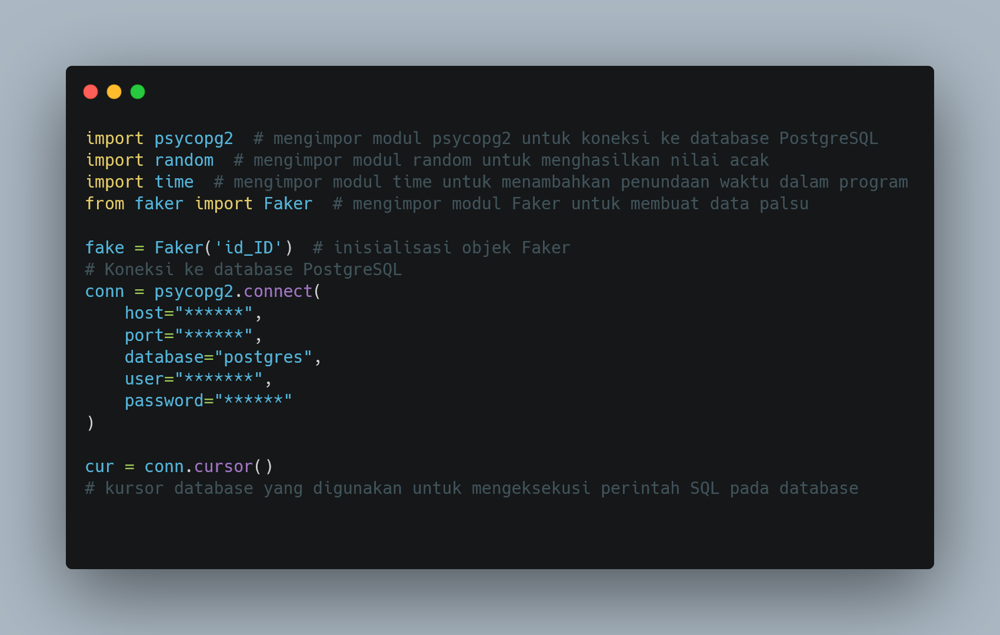
 

    - This Python code snippet imports the psycopg2, random, time, and Faker modules to connect to a PostgreSQL 
    database and generate fake data using the id_ID locale. The psycopg2 library is used to establish a connection 
    to the database by specifying the host name, port number, database name, username, and password.
    
    Once the connection is established, a cursor object cur is created to execute SQL commands on the connected 
    database. The cursor object is used to send queries and retrieve results from the database.

 

    Generating Fake Data for Dim_User_Seller and Dim_User_Buyer Tables
 

 

  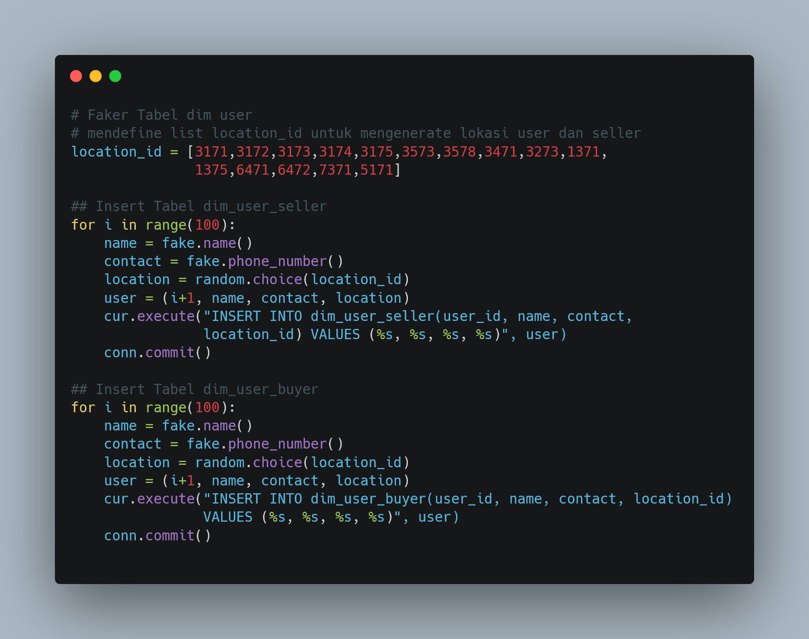
 

    - The code snippet inserts fabricated data into two tables, dim_user_seller and dim_user_buyer, within 
    a PostgreSQL database. A pre-defined list of location IDs is utilized to produce random locations for both 
    sellers and buyers. The code employs a for loop to produce 100 counterfeit records for each table.
    
    Inside the loop, the fake.name() and fake.phone_number() functions are invoked to create random names 
    and phone numbers, respectively. The random.choice() function is used to randomly choose a location ID 
    from the pre-defined list.
    
    The fake data is then inserted into the dim_user_seller and dim_user_buyer tables using the cur.execute() function. 
    The conn.commit() function is called after each iteration of the loop to save the alterations to the database.

 

    Generating Fake Data fact_advertisement

 

 

  
 

 
    - Insert data into the fact_advertisement table by executing a loop for 1000 times. In each iteration,
    the script generates fake data such as ad_id, product_id, user_id, title, description, price_sell,
    and date_created.
    - Insert data into the dim_bid_buyer table by executing a loop for 300 times. In each iteration, 
    the script generates fake data such as bid_buyer_id, user_id_buyer, product_id, bid_price, and date_created. 
    -Insert data into the fact_interest table by executing a loop for 1000 times. In each iteration, 
    the script generates fake data such as interest_id, user_id_buyer, product_id, location_interest, and date_created. 

 

  Generating Fake Data 
 

 

  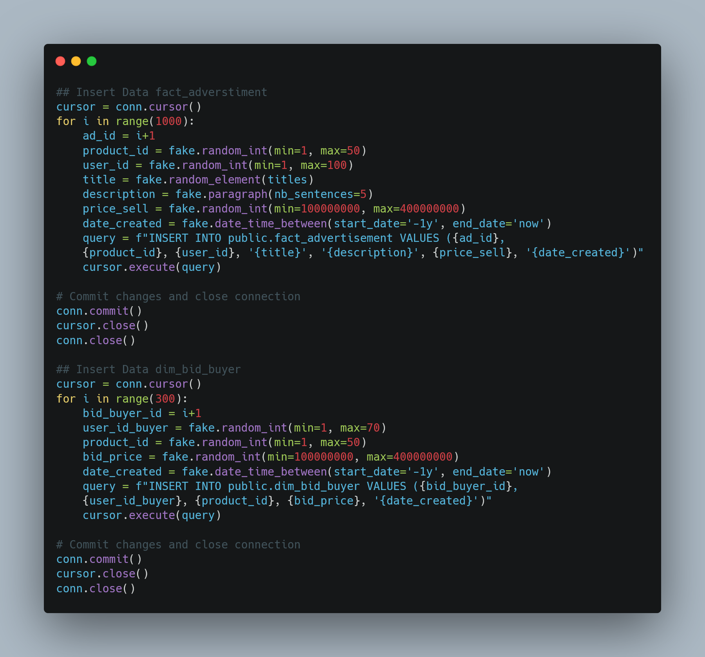
 

    Then, the script constructs an SQL query using the generated data and executes it using a cursor object. 
    Finally, the script commits the changes and closes the connection to the database.

## Transactional  Query  Project
   At this stage, we are asked to provide an insight by finding the nearest used car based on a city ID, 
   where the closest distance is calculated based on latitude and longitude. The distance calculation can be 
   done using the Euclidean distance formula based on latitude and longitude.
   
   The expected result is to calculate the nearest distance to find the closest car to the city ID 3173. 
   To do this, we need to obtain the latitude and longitude values of the used car dealerships and calculate 
   the Euclidean distance between them and the city ID 3173. The dealership with the shortest distance 
   will be considered the closest to the city.

 

   Nearest used car based on a city ID
 

 

  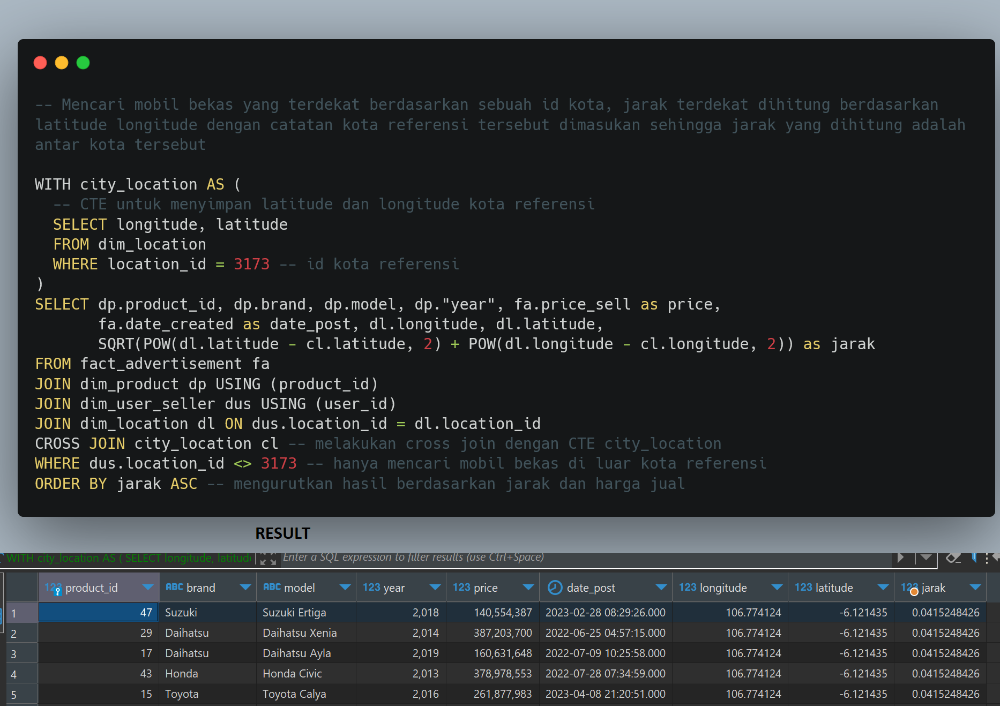
 

    
 ## Analytical   Query  Project
    In this code snippet, we are comparing the prices of cars based on the average price per city. 
    The query retrieves the city, brand, model, and year of the car from the fact_advertisement table. 
    It then joins this table with the dim_product, dim_user_seller, and dim_location tables using their respective keys.
    
    To calculate the average price per city, the query uses the AVG() window function over the partition 
    of the city column. This means that the average price is calculated for each city separately. 
    The result is then ordered in descending order based on the car's year.

 

  Query Compare Car Prices Based on Average Price per City
 

 

  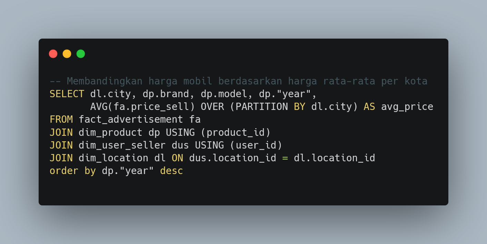
 

    
  

  Output Query
 

 

  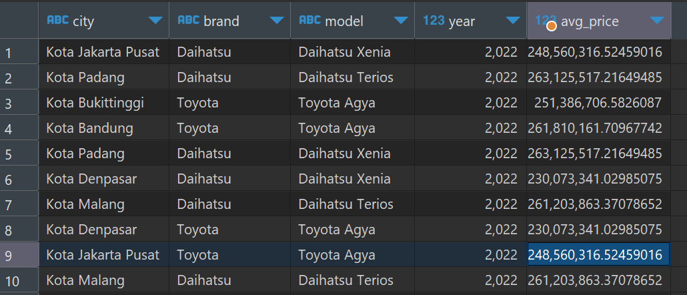
 

    This code snippet compares the percentage difference between the average price of cars based on their models and 
    the average bid price offered by customers in the last 6 months.
    The query uses common table expressions (CTE) to calculate the average price of cars and the average bid price 
    for each car model. The first CTE calculates the average price of cars using the fact_advertisement table, and 
    the second CTE calculates the average bid price offered by customers in the last 6 months using the dim_bid_buyer table.
    
    The main query then joins these two CTEs using the model column and calculates the difference and percentage 
    difference between the average price and the average bid price. The result is then ordered by the car brand.

  

  Query Compare the Percentage Difference Between Average Car Prices and Average Bid Prices.
 

 

  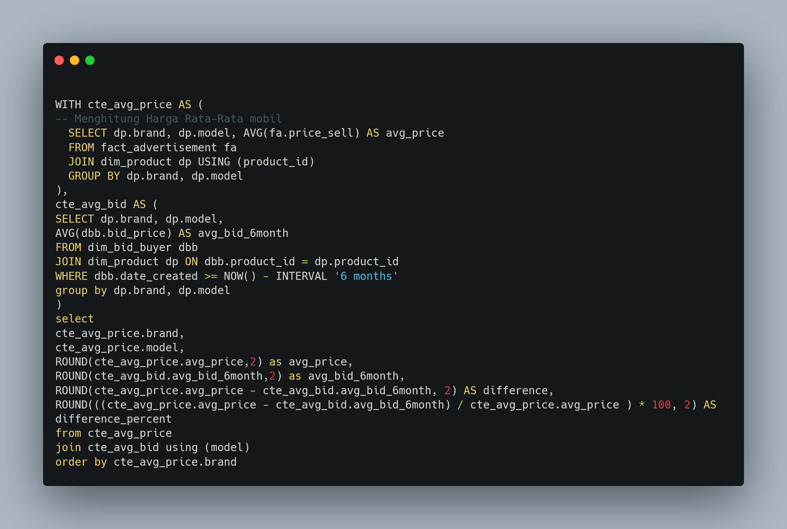
 

  

 Output Compare the Percentage Difference Between Average Car Prices and Average Bid Prices.
 

 

  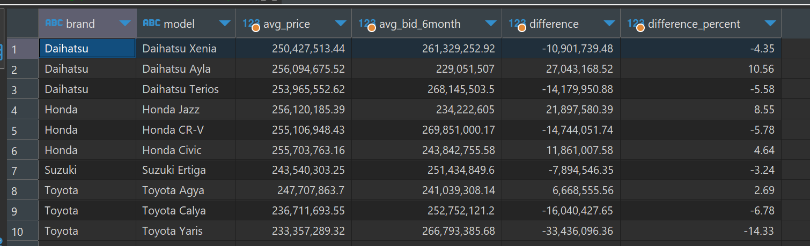
 

## Developed By
1. [Rahmad Gunawan, Linkedin (Link)](https://www.linkedin.com/in/ragunnn/)

      This is the result of my work, but I believe there is still room for improvement in this project. If you have any suggestions or would like to connect with me, feel free to do so. I greatly appreciate you taking the time to review my work. Together, we can create something even better!

  
  

